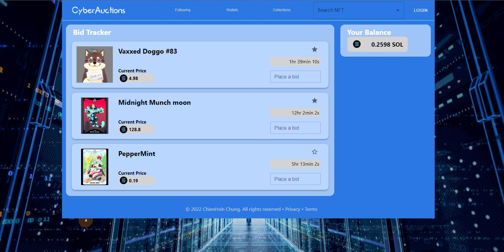
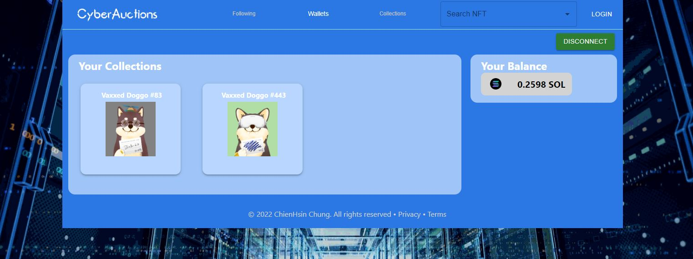
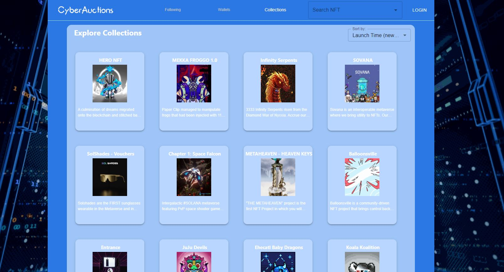

# Cyber Actions Project on Solana

## About
Cyber Actions is a NFT dashboard on Solana blockchain which a user can follow the NFTs they like and add it on the dashboard. whenever the NFT is market, Cyber Actions will notify the user. User can link their Solana wallet and place their bid. 




### Connect your wallet


### Expore NFTs in Magic Eden



## Built with
The project is built in React with MongoDB. Back end is built by using Express framework.


* [React.js](https://reactjs.org/)
* [BlockchainAPI](https://docs.blockchainapi.com/#section/About)
* [MagicEdenAPI](https://api.magiceden.dev/)
* [Mongoose](https://mongoosejs.com/docs/)
* [Express](https://expressjs.com/pt-br/)
* [Material-UI](https://github.com/mui/material-ui)

## How to use
After installing node, clone this repo:

```
git clone https://github.com/vincentchung932/CyberActions.git
````

Then install dependencies in server folder
```
npm init
npm install mongoose express cors
```
And in client folder
```
npm install axios react-router-dom@5
```

An API key pair is required which can be applied through [BlockchainAPI](https://docs.blockchainapi.com/#section/About). Replace the variables `APIKeyID.apiKey` and `APISecretKey.apiKey` in ./client/src/Views/Wallet.jsx.
```javascript
APIKeyID.apiKey = "YOUR API KEY";
APISecretKey.apiKey = "YOUR SECRET KEY";

```

Run server and client in separated terminals:

```bash
cd client
nodemon server.js
```

```bash
cd client
npm start
```

## Contact Me
If you have any question or problem running this project just contact me: [zhongqianxinqqq@gmail.com](mailto:zhongqianxinqqq@gmail.com)